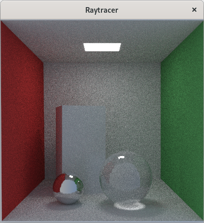

## About
This is a simple ray tracer that was developed as a college class project. It is based on the [Ray Tracing in One Weekend](https://raytracing.github.io/) series but adapted to the Rust programming language and expanded to include additional features.

## Features
- Diffuse, glass, emissive, reflective materials
- Multithreading (one tile per thread)
- BVH acceleration
- OBJ meshes
- Sphere and box shapes
- Displays live updates in a window

## Screenshot

